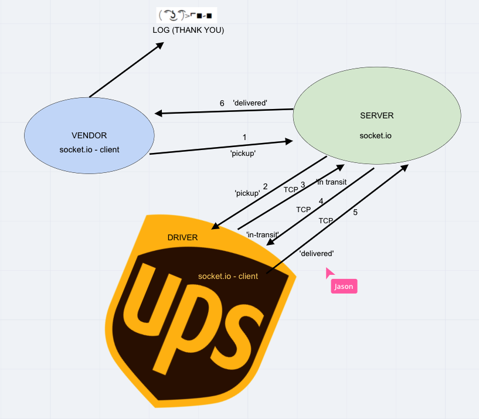

# lab-12 CAPS

## Description

- `CAPS Phase 1:` Begin the build of an application for a company called CAPS - The Code Academy Parcel Service. In this sprint, we’ll build out a system that emulates a real world supply chain. CAPS will simulate a delivery service where vendors (such a flower shops) will ship products using our delivery service and when our drivers deliver them, be notified that their customers received what they purchased.

Tactically, this will be an event driven application that “distributes” the responsibility for logging to separate modules, using only events to trigger logging based on activity.

- `CAPS Phase 2:` Continue working on a multi-day build of our delivery tracking system, moving event management to socket.io

In this phase, we’ll be moving away from using TCP for our event network and switching instead in to using socket.io, which takes on some of the complexity we had to manage ourselves, and also works equally well between servers and with websites.

The intent here is to build the data services that would drive full dashboard where we can see pickups and deliveries as they happen.

- `CAPS Phase 3:` Complete work on a multi-day build of our delivery tracking system, adding queued delivery

## Author: Jason Quaglia

- [Link to Github Actions Tab](https://github.com/jquaglia/caps/actions)

- [Link to PR on Github](https://github.com/jquaglia/caps/pull/7)

## Collaborators

- Jason Dormier

- Carly Dekock

- Nick Magruder

- Bill Moreno

- Seid Mohamed

## The Setup

### Getting Started

1. Clone down the repository

1. Run the command `npm install` from inside `driver`, `server`, and `vendor` folders.

1. Create a `.env` file with `STORE_NAME` variables

### Testing the Server

1. Open 3 terminal windows to each of the 3 folders listed above.

1. In `server` run the command `node server.js`

1. In `client` run the command `node client.js`

1. In `driver` run the command `node driver.js`

1. You should see in the server window a list of the events.

1. You will see driver events in the driver window.

1. Vendor events will be in the vendor window.

## UML

